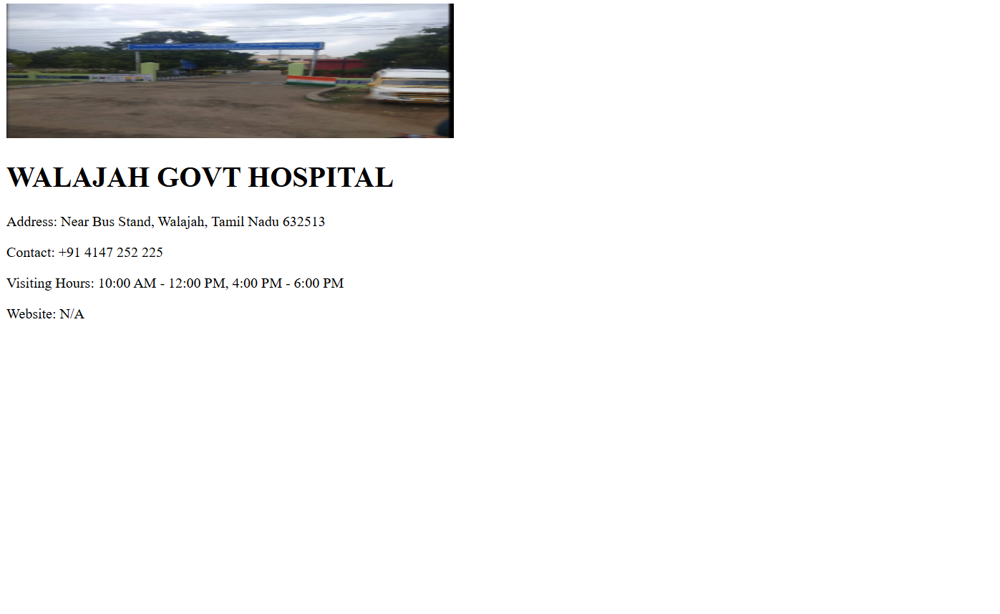
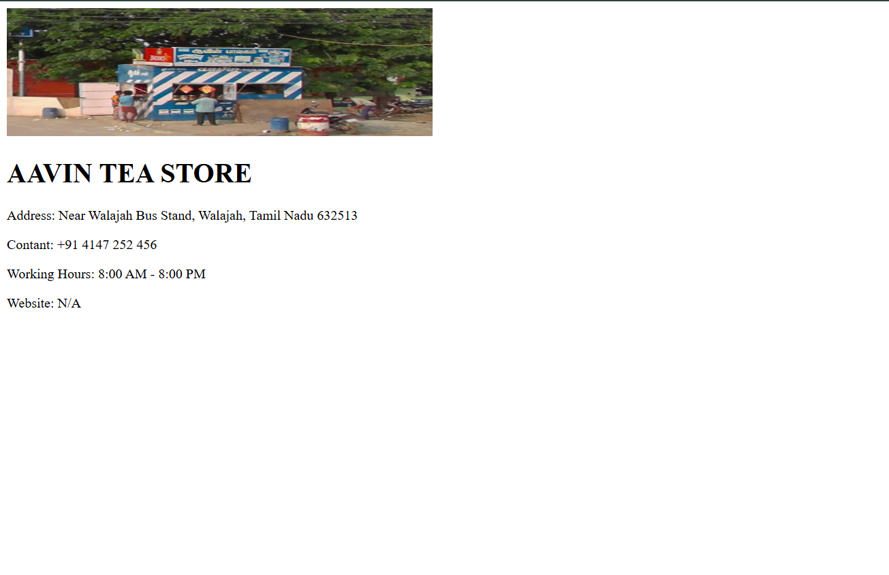

# Ex04 Places Around Me
## Date: 10/12/2025

## AIM
To develop a website to display details about the places around my house.

## DESIGN STEPS

### STEP 1
Create a Django admin interface.

### STEP 2
Download your city map from Google.

### STEP 3
Using ```<map>``` tag name the map.

### STEP 4
Create clickable regions in the image using ```<area>``` tag.

### STEP 5
Write HTML programs for all the regions identified.

### STEP 6
Execute the programs and publish them.

## CODE
```
place.html

<!DOCTYPE html>
<html lang="en">
<head>
    <meta charset="UTF-8">
    <meta name="viewport" content="width=device-width, initial-scale=1.0">
    <title>Document</title>
</head>
<body>
    <!-- Image Map Generated by http://www.image-map.net/ -->


<map name="image-map">
    <area target="" alt="Walaja GH" title="Walaja GH" href="hospital.html" coords="79,37,301,227" shape="rect">
    <area target="" alt="Indian gas" title="Indian gas" href="gas.html" coords="819,376,143" shape="circle">
    <area target="" alt="tea store" title="tea store" href="aavin.html" coords="109,378,277,375,317,504,93,504" shape="poly">
</map>
</body>
</html>

hospital.html

<!DOCTYPE html>
<html lang="en">
<head>
    <meta charset="UTF-8">
    <meta name="viewport" content="width=device-width, initial-scale=1.0">
    <title>HOSPITAL</title>
</head>
<body>
    
    <h1>WALAJAH GOVT HOSPITAL</h1>
    <p>Address: Near Bus Stand, Walajah, Tamil Nadu 632513</p>
    <p>Contact: +91 4147 252 225</p>
    <p>Visiting Hours: 10:00 AM - 12:00 PM, 4:00 PM - 6:00 PM</p>
    <P>Website: N/A</P>
</body>
</html>

gas.html

<!DOCTYPE html>
<html lang="en">
<head>
    <meta charset="UTF-8">
    <meta name="viewport" content="width=device-width, initial-scale=1.0">
    <title>GAS</title>
</head>
<body>
    
    <h1>INDIAN GAS AGENCY</h1>
    <p>Address: Near Walajah Bus Stand, Walajah, Tamil Nadu 632513</p>
    <p>Contant: +91 4147 252 123</p>
    <p>Working Hours: 9:00 AM - 6:00 PM</p>
    <p>Website: N/A</p>
</body>
</html>

aavin.html

<!DOCTYPE html>
<html lang="en">
<head>
    <meta charset="UTF-8">
    <meta name="viewport" content="width=device-width, initial-scale=1.0">
    <title>STORE</title>
</head>
<body>
    
    <h1>AAVIN TEA STORE</h1>
    <p>Address: Near Walajah Bus Stand, Walajah, Tamil Nadu 632513</p>
    <p>Contant: +91 4147 252 456</p>
    <p>Working Hours: 8:00 AM - 8:00 PM</p>
    <p>Website: N/A</p>
</body>
</html>

```
## OUTPUT




## RESULT
The program for implementing image maps using HTML is executed successfully.
